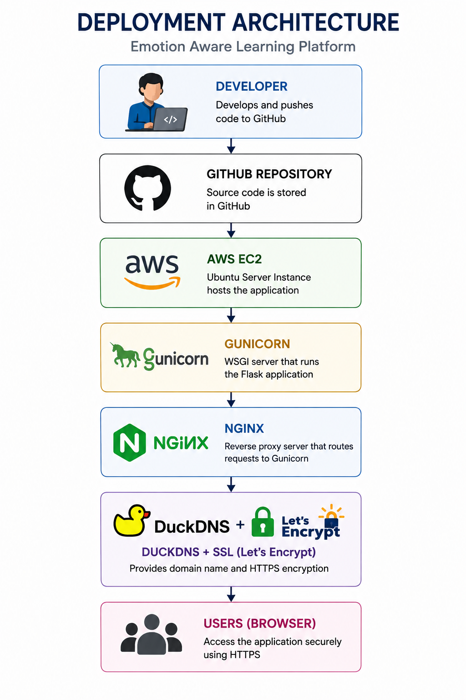

# Deployment Guide

This document explains how to deploy the Emotion Aware Learning Platform on an Ubuntu server using Gunicorn, Nginx, DuckDNS, and SSL.

---

# Deployment Environment

| Component | Technology |
|-----------|------------|
| Operating System | Ubuntu 24.04 LTS |
| Backend | Flask |
| Web Server | Nginx |
| WSGI Server | Gunicorn |
| Database | SQLite3 |
| Domain | DuckDNS |
| SSL | Let's Encrypt |

---

# Clone Repository

```bash
git clone <repository-url>

cd Emotion-Aware-Learning-Platform
```

---

# Create Virtual Environment

```bash
python3 -m venv venv

source venv/bin/activate
```

---

# Install Dependencies

```bash
pip install -r requirements.txt
```

---

# Configure Gunicorn

Example command:

```bash
gunicorn --workers 2 --bind 127.0.0.1:5000 app:app
```

---

# Configure Nginx

Configure Nginx to reverse proxy requests from port 80/443 to the Gunicorn server.

```
Client
     │
     ▼
Nginx
     │
     ▼
Gunicorn
     │
     ▼
Flask Application
```

---

# Configure systemd

Create a systemd service to:

- Automatically start the backend after server reboot.
- Automatically restart the backend if it crashes.

Example commands:

```bash
sudo systemctl daemon-reload

sudo systemctl enable emotion-platform

sudo systemctl start emotion-platform
```

---

# Configure DuckDNS

Update the DuckDNS domain to point to the server's public IP address.

---

# Configure SSL

Generate an SSL certificate using Let's Encrypt.

Example:

```bash
sudo certbot --nginx
```

---

# Verify Deployment

Check:

- Backend is running.
- Nginx is active.
- SSL certificate is valid.
- Application is accessible using HTTPS.

---

# Deployment Architecture

