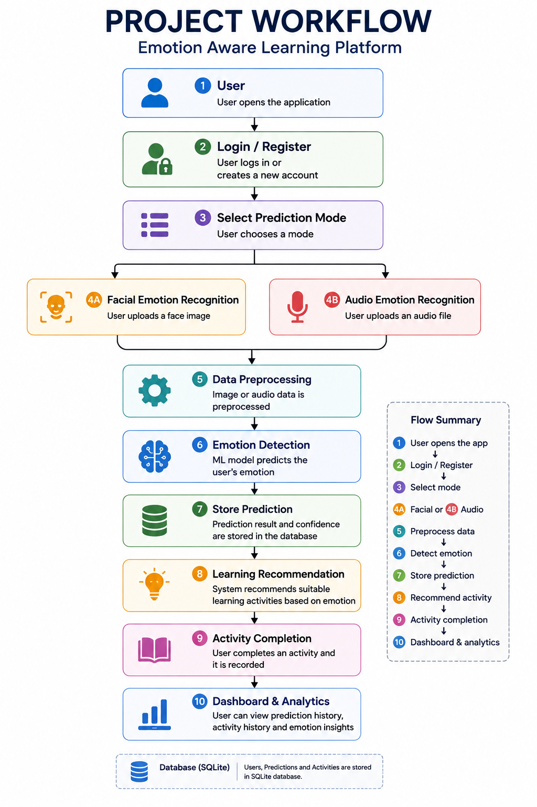

# Project Workflow

This document illustrates the complete workflow of the Emotion Aware Learning Platform from user interaction to personalized learning activity recommendation.

## Workflow

1. User opens the application.
2. The user logs in or creates a new account.
3. The user selects one of the emotion recognition modes:
   - Facial Emotion Recognition
   - Audio Emotion Recognition
4. The selected image or audio is uploaded to the Flask backend.
5. The backend preprocesses the input data.
6. The appropriate machine learning model predicts the user's emotion.
7. The prediction result is stored in the SQLite database.
8. Based on the detected emotion, suitable learning activities are recommended.
9. When the user completes an activity, it is stored in the database.
10. The dashboard displays prediction history, activity history, and emotion analytics.

## Workflow Diagram

