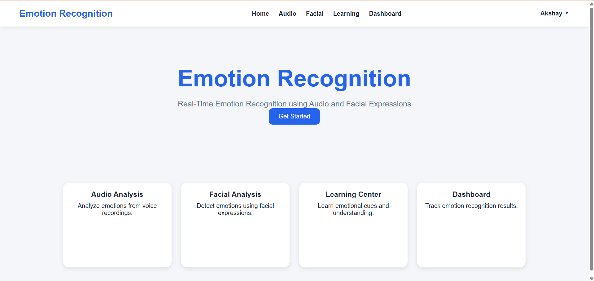
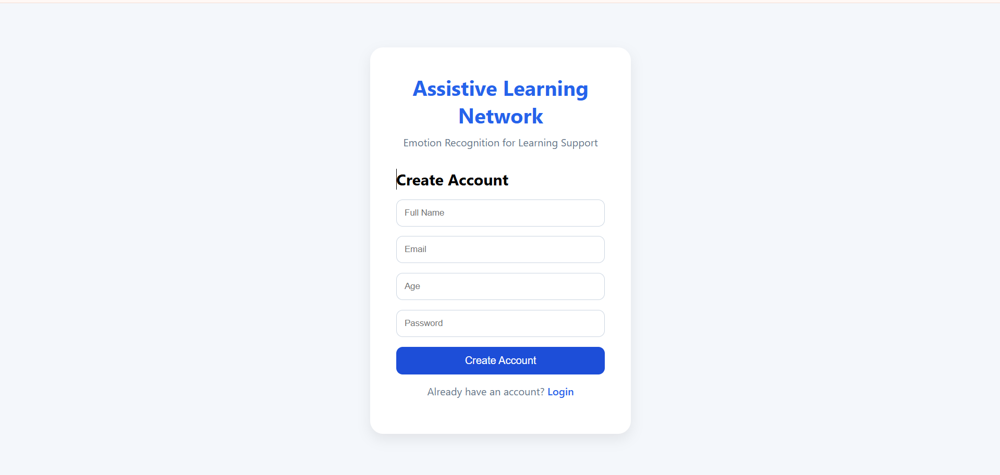
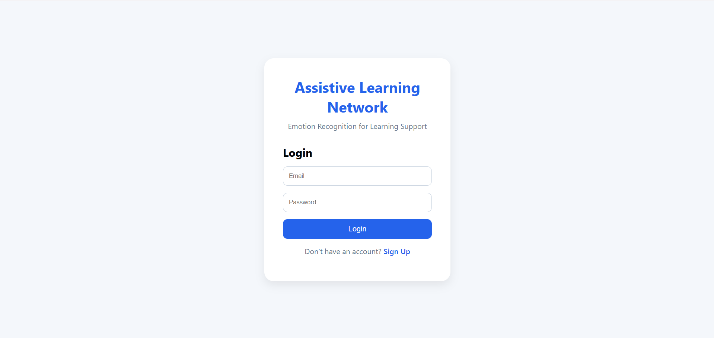
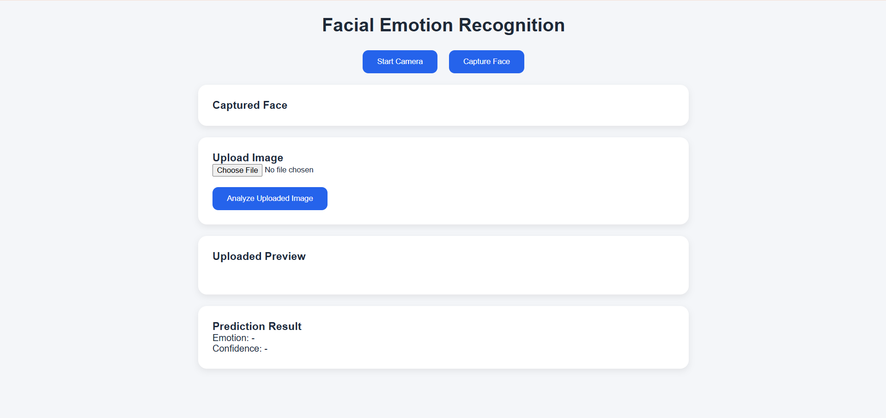
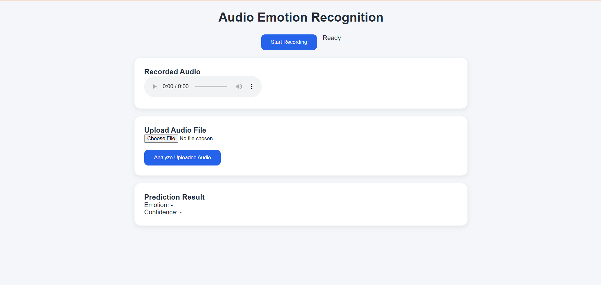
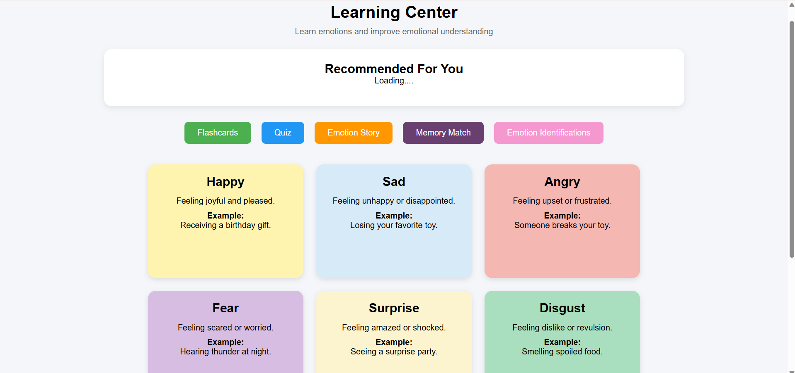
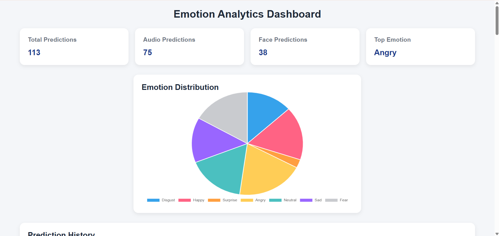

# User Guide

This guide explains how to use the Emotion Aware Learning Platform.

---

# 1. Home Page

The home page provides an overview of the Emotion Aware Learning Platform and allows users to navigate to different modules.

---

# 2. Register

New users can create an account by providing their name, email, age, and password.

Steps:

1. Open Register page.
2. Enter the required details.
3. Click **Register**.
4. Login using the registered credentials.

---

# 3. Login

Existing users can log in using their email and password.

Steps:

1. Enter Email.
2. Enter Password.
3. Click **Login**.

---

# 4. Facial Emotion Recognition

This module predicts emotions from uploaded facial images.

Steps:

1. Open Facial Emotion Recognition.
2. Upload an image.
3. Click **Predict Emotion**.
4. View the detected emotion and confidence score.

---

# 5. Audio Emotion Recognition

This module predicts emotions from uploaded audio recordings.

Steps:

1. Open Audio Emotion Recognition.
2. Upload or record an audio file.
3. Click **Predict Emotion**.
4. View the detected emotion and confidence score.

---

# 6. Learning Activities

The system recommends learning activities based on the detected emotion.

Examples include:

- Flashcards
- Emotion Quiz
- Memory Match
- Emotion Story
- Image Emotion Identification

---

# 7. Dashboard

The dashboard provides analytics about user activity.

It displays:

- Total Predictions
- Audio Predictions
- Facial Predictions
- Most Frequent Emotion
- Prediction History

---

# 8. Logout

Users can securely log out after completing their session.
